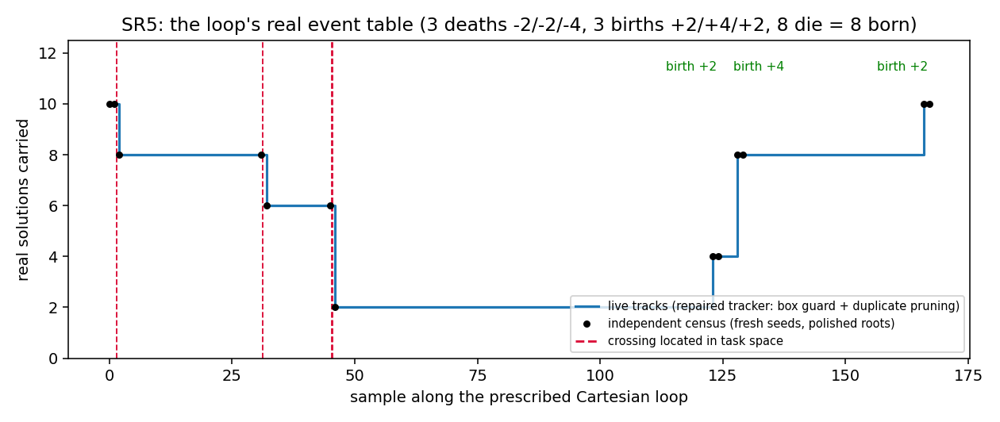
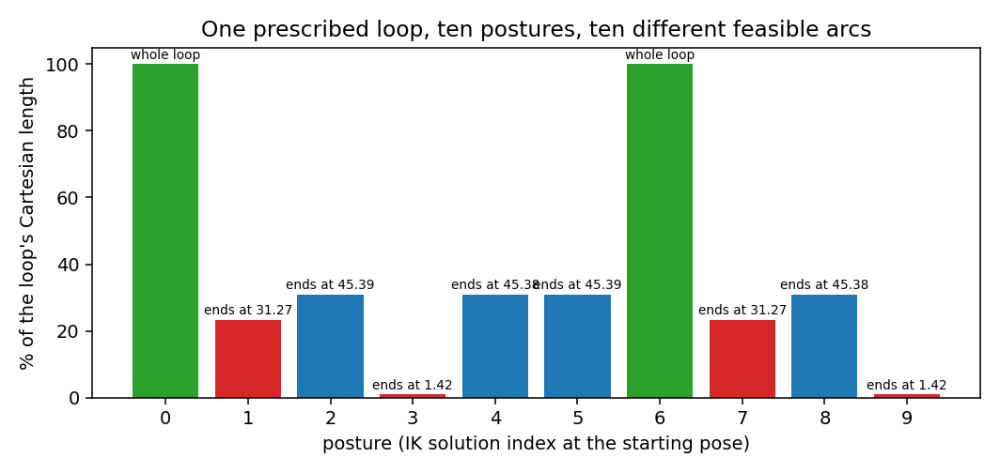

# 深潜 ①：唯一性域，以及"A→B 到底能不能走"

> 零上下文可读。承接 [`README.md`](README.md) 的术语表；本文所有数字都来自本仓库命令。
> 相关实验：`study/exp49_sr5_uniqueness.py`、`exp50_births_and_stops.py`、`exp51_event_resolution.py`、
> `exp52_feasible_arcs.py`；详细日志 `study/NOTES.md` §3.31–§3.52；简报 `study/REPORT.md` 发现 4。

---

## 1. 问题：为什么"同分支"还不够

工程上真正要回答的规划问题是：

> 从姿势 A（对应位姿 A）出发，沿一条**规定好的笛卡尔路径**走到位姿 B，
> 全程**不换姿势**（关节角连续、不跳解），可能吗？

"同分支"（不碰奇异即可互达）只是必要条件。1986 年有一篇论文"证明"了"换解必穿奇异"，
1988 年被反例推翻；我们在本课题里**独立重演了这次翻案**（14 对反例）。

Wenger 的理论给出了更细的工具：把每个分支（aspect）再切成若干**唯一性域**——

```
CS_i = f⁻¹( f(A_i*) ) ∩ A_i          A_i* = aspect A_i 的边界（arXiv:1610.04080 §11 原文）
```

* `f` = 正运动学；`Δ = f(Σ)` = 判别式像（所有"临界位姿"的集合）。
* 因为 `f(A_i*) ⊂ Δ`，所以 **"穿越特征曲面" ⟺ "位姿落在临界位姿上"**——这正是我们的仪器能测的事件。
* `A_i \ CS_i` 的每个连通分量叫**唯一性域**，`f` 在每个分量上是**单射**（一对一）。
* **可行路径域 = 极大唯一性域的像**。直觉：某姿势能一路走到的那些位姿，就是它所在唯一性域被 `f` 映出来的像。

**一个立刻可用的推论**：如果某位姿在某个 aspect 里有 `m` 个解，那么这 `m` 个解**分属 `m` 个不同唯一性域**
（因为同一域内 `f` 是单射，不可能有两个解映到同一个位姿）。所以 SR5 的 12 解位姿 =
**2 个 aspect × 每个 6 个唯一性域**。典型位姿是 8 解 ⇒ 每 aspect 4 个域。

```
位姿 T ──► 解集（纤维）:  q1 q2 q3 q4 q5 q6 q7 q8
                            │  │  │  │  │  │  │  │
                            └──┴──┼──┴──┘  └──┴──┴──┘      ← 符号(det J)把解分成两个 aspect
                                  │
        aspect A+ : 4 个解 ⇒ 4 个唯一性域（互补重叠，各管一片位姿）
        aspect A− : 4 个解 ⇒ 4 个唯一性域
                 每个域 ↔ f(域) = 一片"可行位姿"（该姿势能不变姿势走到的位姿集合）
```

## 2. 仪器：把"整条纤维"锁步跟着走

要测事件，必须同时盯着**所有**解，而不是只看一个。核心工具是 `study/taskspace.py`：

```python
ts.lift_fiber(
    task, jacobian, targets, starts,
    residual=lambda q, T: homotopy.se3_error(homotopy.fk_links(links, q), T),  # 误差必须相对当前位姿
    interpolate=ts.se3_interpolate,        # 位姿区间的二分必须产出"真位姿"（slerp + 线性）
    sigma=lambda q: iks.sigma_min(model, q), sigma_floor=1e-9,
    collision=1e-2, merge=1e-6,            # 判"相撞" / "合并（仪器故障）"
    jump_tolerance=0.3, max_step=0.5,      # 跳盆护栏 / 步长上界
    distance=lambda a, b: iks.configuration_distance(a, b, circular),
    feasible=in_box,                       # 校正点必须落在关节限位盒内（否则跟踪器会走出物理构型）
    prune_merged=True,                     # 与更老轨迹重合的新轨迹退休（跳盆残留）
    admit=admitter,                        # 中途把"新生解"补进跟踪集
)
```

四条设计原则值得记住（每条都是踩坑换来的）：

1. **误差必须相对当前位姿**（`se3_error(FK(q), T)`），否则校正方向错一个随位姿变化的线性映射，
   表现为"分支在健康间隙处莫名死亡"（我们曾因此丢掉 9/10 条分支）。
2. **区间二分必须产生位姿**：两个旋转矩阵的线性组合不是旋转。
3. **跟踪器必须检查关节盒**：它报出的构型可能是"位姿的解，但这台臂到不了"。
4. **"持续合并"是仪器故障**：真 fold 的相撞只持续 **一个**采样（下一采样成对消失）；
   若两条轨迹连续多个采样保持 ~1e-14 的距离，那是校正器**跳盆**后落在同一条分支上。

## 3. 完整实事件表（本轮的正面结果）

`python3 -m study.exp50_births_and_stops --pose-seed 0 --box-guard --prune-merged`（约 7 分钟）



*图 3：沿规定笛卡尔闭环（168 个采样）的"存活解数"。黑点 = 用**全新种子 + 逐根 Newton 抛光**独立数出的
纤维大小（13 个关键时刻），与跟踪器逐点一致；红虚线 = 在任务空间里**夹点定位**的穿越；绿字 = 诞生。*

| 事件 | 采样区间 | 纤维数变化 | 死/生的根（按 `det J` 符号配对） |
|---|---|---|---|
| 消亡 | 1 → 2 | 10 → 8 | 轨迹 3 (−1) 与 9 (+1) |
| 消亡 | 31 → 32 | 8 → 6 | 轨迹 1 (+1) 与 7 (−1) |
| 消亡 | 45 → 46 | 6 → 2 | (2,−1)+(5,+1) 与 (4,−1)+(8,+1) ⇒ **两次 fold** |
| 诞生 | 122 → 123 | 2 → 4 | +2 |
| 诞生 | 127 → 128 | 4 → 8 | +4 |
| 诞生 | 165 → 166 | 8 → 10 | +2 |

**8 条根死去、8 条根诞生**，纤维数回到起始值，且**每次消亡都是两条 `det J` 异号的根**
（与"fold 的两支分属两个 aspect"一致）⇒ **每次事件就是离开/进入一个唯一性域**。

被跟踪的姿势（轨迹 0）最后落到**另一个解**上（距离 `0.0e+00`）⇒ 这条闭环**确实在不碰奇异的前提下换了姿势**；
但它的像**穿过了判别式像**，所以它只待在起始唯一性域的像里一段时间——这正是"A→B"的答案。

## 4. 把穿越"钉"在位姿上

只报"第 45~46 个采样之间发生了事情"没有用。`exp51` 做两件事：

1. **细分路径**（把该区间的关节路径分成 96 小段）⇒ 45→46 的 **−4 拆成两个 fold**（闭环共六次穿越）。
2. **在任务空间二分**：判据是"两条支**仍是两个不同实根**"（每个种子只做局部延拓并带跳盆护栏，
   所以"随机普查碰巧收敛"不能冒充延拓）；二分点一律用 `ts.se3_interpolate` 产生**真位姿**。

```
夹点处两条独立证据同时给零：
   成对间隙     1.9e-06 … 3.0e-04 rad      （两条支几乎重合）
   合并构型 σ_min 6.2e-08 … 2.8e-06         （该构型离奇异只差这个量级）
   对比：跟踪器"停止"处的 σ_min 是 1.2e-02 量级 —— 差三到五个数量级
间隙随"任务偏移"消失的幂律：指数 0.501 / 0.501 / 0.503 / 0.503（理论 1/2）
```

其中一次还用**增广系统**（未知 `(q, τ)`；方程 = 位姿 6 式 + `det J = 0`；`τ` 用权重行钉在事件段内）
把穿越认证成一个**奇异构型**：`τ = 0.379368`、残差 `4.3e-10`、`det J = 1.7e-17`、`σ_min = 1.7e-16`。

> 仪器陷阱：如果不把 `τ` 钉住，牛顿会沿**外推的位姿直线**跑掉，收敛到路径根本没经过的 fold
> （实测 `τ = −90`、`5340`、`−15696` 而残差很小）。

## 5. A→B 的可操作答案

`python3 -m study.exp52_feasible_arcs --pose-seed 0`（约 20 秒）



*图 4：同一条闭环（笛卡尔长度 4.5335，167 个区间），十个起始姿势各自能走的部分。*

| 姿势 | 符号 | 可行弧（采样） | 占闭环笛卡尔长度 | 弧端（已定位穿越，成对姿势） |
|---|---|---|---|---|
| 0 / 6 | −1 / +1 | 0..167 | **100.0%** | 无（整条闭环） |
| 1 / 7 | +1 / −1 | 0..31 | 23.2% | 采样 31.2693（`σ_min` 1.3e-07） |
| 2 / 5 | −1 / +1 | 0..45 | 30.8% | 45.3948（8.2e-08） |
| 4 / 8 | −1 / +1 | 0..45 | 30.8% | 45.3847（2.7e-07） |
| 3 / 9 | −1 / +1 | 0..1 | **0.9%** | 1.4176（1.8e-06） |

**读法**：

* 每一对都是**一个符号对一个符号**，四个弧端正是四次 fold 穿越；
* "这条路径能不能跟"**没有一个与姿势无关的答案**：同一路径，有的姿势拥有整圈，有的只拥有 0.9%；
* 弧的长度 = 该姿势的可行路径域（唯一性域的像）与这条路径的交集；
* 所以规划规则是：**先选定姿势，再让路径待在它的可行域里**；跨域就要接受"从临界位姿上穿过去"。

**诚实的限定**：两条独立路线（跟踪器死亡样本 + 细分二分；以及在区间内"行走"两条支的种子后再二分）
给出同样的配对、同样的拆分、同样的指数，但对同一次穿越的位置相差 **0.003~0.0055 个采样**
（这条闭环上约 **0.1 mm**）。差异有结构原因（fold 附近校正病态，跟踪器可能提前放弃），记为**未决**。
**教训：二分夹点宽 1e-6 是"二分的停止规则"，不是"穿越位置的精度"。**

## 6. 一条旧读数的更正（值得单独记住）

课题早期在**另一条**闭环（118 采样）上报过"**3 个碰撞采样（46/47/48）**，一对分支合并到 9.12e-15 后成对消亡"，
并把它当作"判别式穿越"的证据。最近的复核（`exp49 --box-guard --prune-merged --locate`）表明：

* 那个"合并"**持续了 3 个采样**（轨迹 0/7）⇒ 按上面的判据是**跳盆故障**；
* 修好仪器后该闭环 **0 碰撞、0 合并、最短间隙 2.20e-01**；
* 但**换姿势的主结论不变**：被跟踪姿势仍到达解 6，距离 `0.0e+00`；
* 用夹点仪器在该闭环上重新定位到**两次真穿越**（采样 0.342537：间隙 5.6e-04、`σ_min` 5.9e-06、指数 0.500；
  41.288747：2.8e-06、1.3e-07、0.501）；
* 还测到一个更微妙的事件：**34→35 是"一次消亡 + 一次诞生相抵"**（存活 8、普查 8、其中一根无延续）
  ⇒ **基于"存活数下降"或"间隙变小"的检测器在这条闭环上什么都读不到**。

## 7. 复现与代码入口

```bash
python3 -m study.exp49_sr5_uniqueness --pose-seed 0                      # 基线（会复现旧的 3 次"碰撞"读数）
python3 -m study.exp49_sr5_uniqueness --pose-seed 0 --box-guard --prune-merged --locate   # 更正后的读数 + 夹点
python3 -m study.exp50_births_and_stops --pose-seed 0 --box-guard --prune-merged         # 图 3 的数据
python3 -m study.exp51_event_resolution --pose-seed 0 --subdivisions 96                  # 拆分与夹点
python3 -m study.exp52_feasible_arcs --pose-seed 0                                       # 图 4 的数据
```

* 关键代码：`study/taskspace.py`（`lift_fiber` 及其 `admit`/`feasible`/`prune_merged`/`closest`/`duplicates`）、
  `study/exp50_births_and_stops.py`（`FiberAdmitter`、`root_census`、`distinct_live`）、
  `study/exp51_event_resolution.py`（`localise_crossing`、`refine_fold_pose`、`pair_dead_roots`）、
  `study/exp52_feasible_arcs.py`（`march_to_fold`、弧表）。
* 日志：`.scratch/exp50_carry_s0b.log`、`.scratch/exp50_guarded_s0.log`、`.scratch/exp51_s0.log`、
  `.scratch/exp52`（见 `NOTES` §3.40–§3.42 的引用）。
