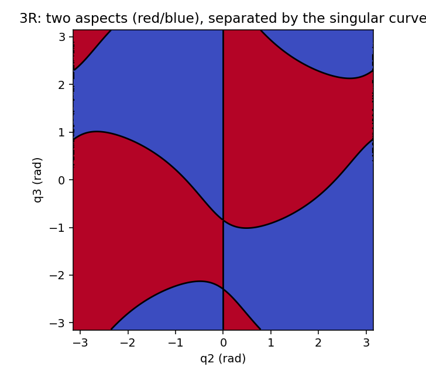
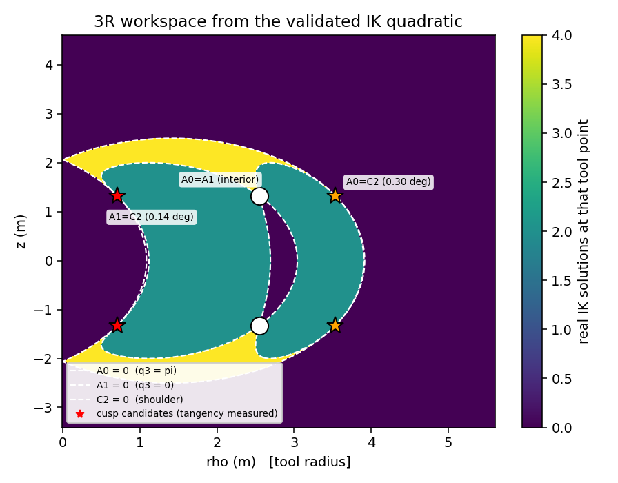

# 深潜 ②：为什么这台臂没有闭式解，我们怎么绕过去；以及那台 3R 玩具臂的完整故事

> 零上下文可读。承接 [`README.md`](README.md) 的术语表。
> 相关实验：`study/exp10_sr0_geometry.py`、`exp11_dh_continuation.py`、`exp12_sr0_solver.py`、
> `exp13_homotopy_sr0_to_sr5.py`、`exp25_deterministic_count.py`、`exp53_second_neighbour.py`、
> `exp48_cuspidal3r.py`、`exp54_cusp_discriminant.py`；详细日志 `study/NOTES.md` §3.32、§3.44–§3.52。

---

## 1. "没有闭式解"是一个可以测出来的几何事实

经典结论（Pieper）：六轴臂若有**三根连续的轴交于一点**（典型是腕部三轴），逆解就能化成
一个四次以内的多项式 ⇒ 有根号解。SR5 不满足：

```
SR5 的轴几何（相邻轴公垂距离 / 夹角，与位形无关的不变量）：
  轴 1-2、1-4、4-5、5-6 相交；轴 2 ∥ 3，相距 0.403 m；
  腕部轴 4–6 的公垂距离 = 0.136 m   ← 就是它破坏了 Pieper 条件
```

`python3 -m study.exp10_sr0_geometry` 把 18 个"单参数放松"逐个试了一遍：
**只有把 link 5 的 y 偏置清零**（0.136 m → 0）能让腕部三轴共点。得到的"近似臂"叫 **SR0**。

```
真机 SR5：  腕部三轴不共点 ⟹ 无闭式解
SR0：       腕部三轴共点   ⟹ 有闭式解（8 解/位姿、残差 ≤ 8.0e-10、约 70 ms）
两者之间：  只差一个参数（link 5 的 y 偏置 0 → 0.136 m）
```

## 2. 用"连续变形"把解带回真机（延拓/同伦）

思想：把参数 `s` 从 0（SR0）连续变到 1（SR5），每动一小步就用牛顿法把解"扶着"往前走。

* 一阶预测 `dq = −pinv(J_q) J_dh Δs`，误差 `O(Δs²)`（实测误差比 100.0–100.5 / 十倍步长）。
* **奇异附近必须缩步**：在 `σ_min = 3e-3` 处，同样的 0.01 m 步长会给出 2.2 rad 的伪步。
* **丢解的机制被解析清楚**：`fold` —— 两个解在某个 `s*` 处相撞后消失；用增广系统
  （位姿正确 + `det J = 0`，7 方程 7 未知）可把 `s*` 精化到残差 `1e-11` 量级。

实测 SR5 的 fold 谱：**4 个诞生**（`0.655086 / 0.657375 / 0.658119 / 0.655086` 一族）
+ **3 个消亡**（`0.718354 / 0.799244 / 0.961848`）；分裂指数实测 **0.389–0.448**
（理论值 1/2，即 `q(s) ≈ q* ± c√|s − s*|`）。

**两条可测推论**（都验证了）：

* **实事件 ±2 定律**：每穿过一个 fold，实解数变化 ±2（消亡侧零噪声）；
* **Raghavan–Roth 上界 16 被真正达到**：`s = 0.66 / 0.70` 处实测 16 个环面不同、物理可达的实解。

## 3. 这条路的边界（必须一起说）

```
约 20–30% 的位姿：SR0 的位置子问题没有实解 ⇒ SR0 求解器返回 0 个种子 ⇒ 延拓无法启动
   （exp43 的两次取样：fk 取样 4/20、工作空间取样 6/20；我们另一次 60 位姿取样是 7/60 = 12%，
     二项区间重叠，不矛盾）
约 4 成位姿：根本没有 fold（12 位姿存活 [8,0,8,6,8,7,7,8,2,7,6,8]，5/12 全存活）
   ⇒ 那些位姿上 0.5 s 的直线延拓**本来就完备**
```

## 4. 第二个可解邻机：把轴改成"三连续平行"

Pieper 的另一半条件是**三根连续轴平行**。SR5 已经有轴 2 ∥ 3，所以只要改一个扭转：
把 link 4 的旋转从 `Rx(−90°)` 改成 `Rx(0)` 或 `Rx(180°)` ⇒ **轴 2 ∥ 3 ∥ 4**。

`python3 -m study.exp53_second_neighbour --poses 60 --seeds 200 --homotopy --reference-seeds 400`

| 臂 | 轴(3,4)夹角 | 腕间隙 | 满秩 |
|---|---|---|---|
| SR5（原样） | 90.000° | 0.1360 m | 200/200 |
| SR0（腕闭合） | 90.000° | **0.0000 m** | 200/200 |
| 平行（link4 扭转 0°/180°） | **0.000°** | 0.1360 m | 200/200 |

**覆盖**：60 个位姿里 SR0 盲 **7 个（12%）**，两个平行候选**在这 7 个上都有实解**（SR5 普查对照 0 漏）。
**播种**：走 twist 0 → −90° 的延拓 ⇒ **1/7 盲位姿被完整恢复、16/35 参考解被到达**；
再加 103 次曲线路径重试 + 第二条平行臂（共 56 条起点）⇒ **到达数升到 24，但命中的不同解仍是 16/34**。

**为什么提升不上去（重要）**：这些位姿上平行臂只有 **4** 个实解，而 SR5 有 8 个
⇒ 其余解在 `s = 0` **没有对应支**，只能在 twist 路径上"诞生"。我们实现了"**沿路径补入诞生**"
（逐 `s` 采样普查 + 把未被占据的解加进跟踪集）——盲位姿确实**完整恢复**（14/14），
但剖面显示 **6 次诞生全部发生在 `s = 1.00`**（路径上 40 个格点的普查一直只有 4 个解；
300 种子深对照在 `s = 0.5/0.95` 也是 4 个解，收敛 109/75 次）⇒ **"补入诞生"退化成"对目标臂做一次普查"**。

**结论（可操作的用法）**：SR0 有解时用 SR0 播种；SR0 盲的位姿用任一平行臂播种（各给 4 个真起点）；
再用既有的普查/扫描补全纤维。第二邻机的价值是**"盲位姿不再无种"**，而不是"一条直线同伦现在能解它"。

## 5. 3R 玩具臂：证明"能公式解"与"分支复杂"是两件独立的事

为了让"可解性与分支结构正交"有一个**正见证**，我们用一台三轴互正交臂（Wenger 图 1 的族）：

```
MDH 行 [d, α, a] = (0,0,0), (1, π/2, 1), (2, π/2, 0)；工具 (1.5, π/2, 0)
```

### 5.1 它是 cuspidal（分支复杂）

`python3 -m study.exp48_cuspidal3r`



*图 1：把 `T² \ Σ`（关节角的二维环面去掉奇异曲线）**精确标号**：红/蓝两块 = **恰好 2 个 aspect**，
黑线 = 奇异曲线（`det J = 0`）。*

* `rank J = 3`：200 个随机构型全满秩（最早的一版构造因两轴平行而退化，已修）；
* 300×300 网格上 aspect 格点 **44700 / 44700**（奇异格 0.67%）⇒ 恰好 2 块；
* 纤维直方图（40 位姿）：25 个位姿 2 解 ⇒ `(1,1)`；**15 个位姿 4 解 ⇒ `(2,2)`**
  ⇒ **同一个 aspect 内、同一位姿有两个解** ⇒ **按定义是 cuspidal**。

### 5.2 它的逆解是"`t²` 的显式二次式"（可根式解）

用 `q1 = 0`（该臂的 `(ρ,z)` 与 `q1` 无关）与 Weierstrass 代换 `u = tan(q2/2)`、`t = tan(q3/2)`，
把两个位置方程变成 `u` 的多项式，取结式并**正确地**化简（见 5.4 的坑）：

```
结式 = (t²+1)² · (t²+4)² · (4t²+1)² · Q(t)
Q(t) = A₀ t⁴ + 2 A₂ t² + A₁        ← 只有这个因子是真的；它只是 t² 的二次式
A₀ = 16R² + 32RZ − 360R + 16Z² − 296Z + 1769
A₁ = 16R² + 32RZ − 168R + 16Z² − 104Z + 185
A₂ = 16R² + 32RZ − 264R + 16Z² − 200Z + 401        （R = ρ², Z = z²）
```

⇒ 位置 IK 等价于 **`w = t²` 的二次方程**，根式可解（而且解是显式的）。
**核对**：把 `Q` 的根与模型自身普查出的 `tan²(q3/2)` 逐点比较，`python3 -m study.exp54_cusp_discriminant` 给

```
(ρ,z)=(1.20,+0.40) 纤维 2 解 → 正根 1 个（命中 1 个），|t²| 偏差 8.33e-17
(2.00,−0.30) 2.00e-15 | (2.60,+0.90) 1.74e-11 | (3.20,+0.20) 2.36e-15 | (4.00,−0.60) 纤维 0 解 ✓
```

### 5.3 它**有 cusp**（边界尖点），而且两处相切被实测

完整的判别式（关于 `t` 的四次式）是 **三个分量**：

```
Disc_t = A₀ · A₁ · C₂²
   A₀ = 0 : 无穷远根（q3 = π）
   A₁ = 0 : w = 0 的二重根（q3 = 0，肘部伸直）
   C₂ = 0 : 肩型二重根，C₂ = 16R² + 32RZ − 264R + 16Z² − 136Z + 289
```



*图 2：**用已验证的 IK 二次式**逐点算出"该工具点有几个实解"（黄 = 4 解、青 = 2 解、深 = 不可达），
白色虚线是三个判别式分量；★ = 两个**边界切点**（cusp 候选），○ = 一个"内点"切点。
三个切点的闭式：`Z = 7/4`、`R ∈ {13/2, 25/2, 1/2}`。*

| 分量交点 | `(ρ, z)` | 其他分量 | 纤维数 3×3 网格（±0.02） | 判定 |
|---|---|---|---|---|
| `A₀ = A₁` | (2.5495, ±1.3229) | `A₂ = −576` | 全 2（不变） | 两分支相切但**不在可达边界上** |
| `A₀ = C₂` | **(3.5355, ±1.3229)** | **`A₂ = 0`** | 2,2,**0** / 2,2,**0** / 2,**0**,**0** | 在边界上 + 高阶根 ⇒ **cusp 候选** |
| `A₁ = C₂` | **(0.7071, ±1.3229)** | **`A₂ = 0`** | **0,0**,2 / **0**,2,2 / **0**,2,2 | 在边界上 + 高阶根 ⇒ **cusp 候选** |

**实测（kimi 的 `study/exp56_3r_tangency.py`）**：在两处边界候选各追出两条边界弧并量切向——

* `(3.5355, +1.3229)`：切向 `[0.5248, −0.8512]` 与 `[−0.5292, 0.8485]`，**夹角 0.30°**；
* `(0.7071, +1.3229)`：**夹角 0.14°**（第二轮补测）。

**解析后盾（为什么必然相切）**：四个分量的梯度都形如 `(8(4S − c₁), 8(4S − c₂))`，`S = R + Z`，
且 `c₁ ≠ c₂`（`A₀: 45/37`、`A₁: 21/13`、`A₂: 33/25`、`C₂: 33/17`）⇒

* **各分量自身没有奇异点**（梯度不可能同时为零）；
* **任意两个分量在公共点处梯度平行**（都只依赖 `S`）⇒ **相切是必然的**，
  实测的 0.30°/0.14° 是**追踪残差**，不是"接近但没相切"。

⇒ **这台 3R 同时满足三件事：cuspidal（分支复杂）+ 有 cusp（实测算得两处相切）+ 根式可解（`t²` 的显式二次式）**。
这就是"**可解性与分支结构正交**"的完整正见证；负的一侧是 **SR0 实测非 cuspidal**（`exp45`：5 位姿 0 连通）。

### 5.4 这一段走过的弯路（保留，因为它最能说明方法）

1. 最初我算出"**没有 cusp**"，依据是 `C₂` 分量的梯度无零点。
2. kimi 用反例指出：他们追出的 fold 曲线**不在 `C₂ = 0` 上**（沿程 `|C₂|` 中位数 ~240），
   并给出一个 `det J ~ 1e-17`、`q3 = 0` 的肘奇异点（那里 `C₂ = −2.914`）。
   **他们是错的吗？不，是我错了**：全判别式是 `A₀·A₁·C₂²`，我只用了三分之一。
3. 我撤回，补全分量分析 ⇒ 三个切点、两个在边界上。
4. kimi 实测相切（0.30°、0.14°）；我补上"相切必然"的解析证明。
5. 更早还有两个坑：**用浮点数去检查一个清分母后的高次多项式在根附近的值**是灾难性抵消
   （在 `t ≈ −10` 处读出 `−1.0e+05` 的假残差）；**"先把式子因式分解再取结式"会悄悄改变消元**，
   得到的因子在纤维根处是 `+41` 而不是 0。正确路线是：
   **显式 `gcd` → 原始部分的结式 → 在已知纤维根处用高精度（60 位）选因子**。

## 6. 复现命令

```bash
python3 -m study.exp10_sr0_geometry                                   # 0.136 m 与 18 个候选
python3 -m study.exp12_sr0_solver --poses 5 --seeds 400 --match 1e-3  # SR0 闭式解（8 解/位姿）
python3 -m study.exp25_deterministic_count                            # fold 谱 + 确定性完备求解 + 16 解
python3 -m study.exp45_sr0_cuspidality                                # SR0 非 cuspidal（负对照）
python3 -m study.exp48_cuspidal3r                                     # 3R：2 个 aspect、cuspidal（图 1）
python3 -m study.exp53_second_neighbour --poses 60 --seeds 200 --homotopy --reference-seeds 400
python3 -m study.exp54_cusp_discriminant                              # 图 2；有 cusp 候选时退出码 2
python3 -m study.exp56_3r_tangency                                    # kimi 的切向相切实测（0.30°/0.14°）
```
