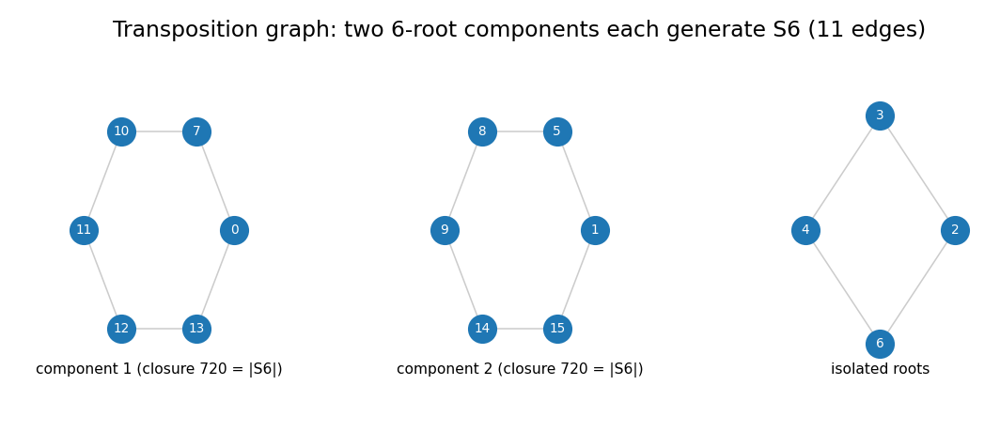

# 珞石 SR5 逆运动学研究：收束文档（从这里开始读）

> **写给谁**：完全没有上下文的人（包括几个月后的我们自己）。
> **写作时间**：2026-10-05。**代码状态**：仓库 `py_robot_library`，分支 `study/ik-branch-and-continuation`，
> 全部结论都可用本仓库的命令复现（`pytest` 217 全绿、`ruff` 干净）。
> **配套**：kimi 会另出一份偏学术口吻的 PDF；这里的 markdown 偏工程叙述，含代码、图与实测数字。

---

## 0. 一句话：我们在研究什么

一台**六轴工业机械臂**（珞石 SR5）在给定末端位姿时，关节角通常有**多组解**。工程与数学上有三个真问题：

1. **判分支**：两组的解（"姿势"）之间，能不能在**不经过奇异姿态**的前提下连续走过去？——这决定轨迹规划能否不变姿势地执行。
2. **求全解**：这台臂**没有经典闭式解**（为什么？能不能绕过去？代价多大？）。
3. **可解性**：它的逆解方程**能不能用根号写出来**（伽罗瓦意义下）？

本课题用"**结构证书 + 数值测量**"回答了这三个问题，并顺手建立起回答它们所需要的仪器学
（每个论断带产生它的命令与数字；每个仪器失误按"表现/根因/修法"归档；分歧用测量裁决）。

## 1. 三条主结论（先看这个）

### 结论 A：分支判据是"两档证书"，且经典标签不可靠

| 结论 | 依据 | 数字 |
|---|---|---|
| `det J` 的**符号**是严格的**单向**证书 | 连续函数在无零点区域不变号 | 异号 ⇒ 必不同分支 |
| "不碰奇异即可达"是**构造性证明** | 保间隙见证走法 + 逐步整段验证 | **14 对**不同解被判连通；负向对照 **68/68** 全部走不通 |
| 经典"肩/肘/腕"标签**双向失效** | 直接测量 | 12 对标签不同却连通、8 对相同却不同支 |
| 经验定律：划分 = 符号划分 | 13 位姿独立复跑 | 12/13 成立（唯一例外是普查欠计数） |

### 结论 B：无闭式解的原因可测，并且可以绕过（有代价）

* 原因是一个**几何量**：腕部轴 4–6 的公垂距离 **0.136 m**（经典条件要求最后三根轴交于一点）。
* 把某个参数清零得到"几乎一样"的可解臂 **SR0**；再用**参数连续变形（延拓）**把解带回真机。
  丢解的机制被解析清楚：**fold**（两个解相撞消失），变形到位时按 **平方根** 分化（实测指数 0.39–0.48）。
* 一般六轴解数上界 **16 被真正达到**（实测）。
* 代价：**20–30% 的位姿**在 SR0 上没有实解（"没有种子"，延拓无法启动）。
* 我们还造出**第二个**可解"近似臂"（三连续轴平行），它**在 SR0 的盲位姿上都有解**（7/7），
  能当种子源；但从它出发的直线延拓只能捞回约一半解（16/35），剩下的解只在接近真机时才出现。

### 结论 C：**无根式解**（最硬的一条）

* 让参数在复平面绕"折点"走一圈，观察解之间如何**互相交换**；把测到的交换拼起来，得到**单值化群**。
* 实测 **11 条对换边**，图分解为 `[6, 6, 1, 1, 1, 1]`；**两个 6 元分量各经显式闭包验证阶 = 720 = |S6|**
  （即"双份独立证据"）。
* `S6` 含单群 `A6` ⇒ 不可解；可解群的子群可解 ⇒ 整个群不可解 ⇒ **逆解方程无根式解**。
* 两条限定：这不排除"闭式消元"（存在 16 次单变量多项式）；这是**复**侧结论，与实侧分支结构**正交**。



*图 5：对换图的连通分量（11 条边）。两个 6 元分量各自生成 `S6`；四个孤立根尚未接入。*

## 2. 这一轮（最近一次研究）多知道了什么

前面三条是课题的骨架。最近一轮把**第一个问题推到了可操作的答案**，并把第二个问题的"玩具见证"补完整：

* **唯一性域**：把分支再细分成"位姿↔姿势一一对应"的小块；我们测出了一条规定闭环上的**完整实事件表**
  （3 次成对消亡 + 3 次成对诞生，**8 死 8 生**），用**独立方法逐点核对**（13 个采样完全一致），
  并把每次穿越**在任务空间定位**（两个独立零证书 + 1/2 次幂律）。
* **A→B 的定量答案**：同一条闭环，**每个起始姿势只能走自己的一小段**：`100% / 23.2% / 30.8% / 0.9%`。
* **3R 玩具臂**：一台同时满足 **cuspidal（分支复杂）+ 有 cusp（边界尖点，实测算得两处相切 0.30°/0.14°）
  + 根式可解（逆解是 `t²` 的显式二次式）** 的三轴臂 —— 证明"可解性"与"分支结构"彼此独立。

细节在 `01`–`03` 三篇深潜里。

## 3. 文档地图

| 文件 | 内容 | 适合谁 |
|---|---|---|
| `README.md`（本文） | 总览、术语表、复现入口、结论账本 | 所有人 |
| [`01-uniqueness-and-planning.md`](01-uniqueness-and-planning.md) | ① 唯一性域、完整事件表、穿越定位、A→B 可行弧 | 想做规划/轨迹的人 |
| [`02-solvability-and-cusp.md`](02-solvability-and-cusp.md) | ② SR0 延拓、16 解、第二个邻机、3R 的 cusp 全流程 | 关心"为什么没有闭式解"的人 |
| [`03-monodromy-and-nosolvability.md`](03-monodromy-and-nosolvability.md) | ③ 单值化群、`S6`、无根式解及其限定 | 关心可解性/代数的人 |
| [`04-instruments-and-open-items.md`](04-instruments-and-open-items.md) | 仪器清单、17 条失误档案、未决清单、协作时间线 | 要接着做的人 |

## 4. 术语表（大白话）

| 术语 | 大白话 |
|---|---|
| 纤维 / fibre | 给定一个末端位姿，**所有**关节角解的集合 |
| 分支 / chamber / aspect | 关节空间里"不碰奇异姿态就能互相走到"的一块；同一块里的解算同一分支 |
| 奇异 / `Σ`、`det J = 0` | 机械臂在某姿态下**瞬间失去某个方向的自由度**（雅可比矩阵降秩） |
| 判别式像 / `Δ` | 所有奇异姿态对应的**末端位姿**集合；位姿落在它上面 = "临界位姿" |
| 唯一性域 | 分支里再切出的、位姿与姿势**一一对应**的小块 |
| 特征曲面 `CS_i` | 唯一性域之间的"边界"在关节空间里的样子 |
| 可行路径域 | 某个姿势能一路走过去而不换姿势的**位姿集合**（= 其唯一性域的像） |
| fold（折点） | 两个解在这一参数值处**相撞后消失**（或相反：出现） |
| cusp（尖点） | 工作空间边界上的尖角（两条边界曲线**相切**接触） |
| cuspidal 臂 | 存在**同一个分支里**、同一位姿有两个解的臂（分支结构与"解数"不一一对应） |
| 单值化群 | 让参数绕圈时，解的**置换**所生成的群；对一般基点等于伽罗瓦群 |
| `S6` | 6 个元素的对称群；含单群 `A6` ⇒ **不可解** ⇒ 对应方程无根式解 |
| 延拓 / 同伦 | 让机械参数**连续变形**，一路带着解走；用来从"可解臂"算"真机"的解 |

## 5. 怎么复现（最少命令集）

```bash
# 环境
cd py_robot_library && python3 -m pytest -q        # 217 passed
ruff check .                                        # clean

# ① 唯一性域与 A→B
python3 -m study.exp49_sr5_uniqueness --pose-seed 0                       # 基线（旧仪器读数）
python3 -m study.exp49_sr5_uniqueness --pose-seed 0 --box-guard --prune-merged --locate
python3 -m study.exp50_births_and_stops --pose-seed 0                     # 事件表（约 7 分钟）
python3 -m study.exp50_births_and_stops --pose-seed 0 --box-guard --prune-merged
python3 -m study.exp51_event_resolution --pose-seed 0 --subdivisions 96    # 细分 + 穿越夹点（约 50 秒）
python3 -m study.exp52_feasible_arcs --pose-seed 0                         # 可行弧表（约 20 秒）

# ② 可解性
python3 -m study.exp10_sr0_geometry                # 腕部 0.136 m 与 18 个候选
python3 -m study.exp12_sr0_solver --poses 5 --seeds 400 --match 1e-3       # SR0 闭式解
python3 -m study.exp25_deterministic_count         # fold 谱与确定性完备求解
python3 -m study.exp53_second_neighbour --poses 60 --seeds 200 --homotopy --reference-seeds 400
python3 -m study.exp48_cuspidal3r                  # 3R：2 个 aspect、cuspidal
python3 -m study.exp54_cusp_discriminant           # 3R：IK 二次式、边界三分量、cusp 候选（退出码 2）

# ③ 无根式解
python3 -m study.monodromy --seeds 600             # 实回路
python3 -m study.exp37_complex_loop                # 复环对换
python3 -m study.exp38_monodromy_group             # 全纤维 16 根 + 边表
python3 -m study.exp40_complex_branches --seeds 2000   # 复分支点普查
python3 -m study.exp44_group_from_edges            # 闭包与可解性判定

# 文档里的图
MPLCONFIGDIR=/tmp/mpl python3 -m study.doc_figures
```

> 注：`study/` 下的实验都在 `testpaths` 之外，**库代码未作任何修改**（本课题的硬约定）。

## 6. 结论账本（截至 2026-10-05）

| 状态 | 内容 |
|---|---|
| **已闭合** | 分支判据两档证书；经典标签失效；划分=符号划分（12/13）；SR0 闭式解 + 延拓 + fold 谱 + ±2 定律；16 解上界达到；**无根式解（双 S6 证据）**；唯一性域事件表与穿越定位；A→B 可行弧表；3R 三性同台（cuspidal + cusp + 根式可解） |
| **部分闭合** | 第二邻机（结构成立、盲位姿全覆盖、直线延拓只到 16/35）；穿越定位精度（两路线差 0.003~0.0055 采样 ≈ 0.1 mm，未决） |
| **待约定** | franka 冗余臂的"自运动分量**真计数**"：读数随普查种子数变化（150 种子 ⇒ 26 解/13 分量；400 ⇒ 67/25），且轨迹预算不足（`--steps 4000` 下 8/25 被截断）；仪器现在会打印 "NOT a count" |
| **待实现** | SR5 同分支配对搜索的结构化 oracle（贪心走法 → 规定笛卡尔回路 + `lift_tiber` 测提升 → 仍失败记"未决"） |
| **已撤回/更正** | 见 `04` 的"撤回清单"：本课题有 6 条曾被记录、后来被测量推翻或更正的结论，全部保留痕迹 |

## 7. 协作方式（也在仓库里）

本课题由两个 AI（DeepSeek 与 kimi）在同一仓库协作，规则是"**可以互相攻击，分歧用测量裁决**"：

* `study/collab/QUESTIONS.md` —— 编号问题清单（Q1…Q26，每条带状态、命令、数字）。
* `study/collab/dayNN-*.md`、`dayNN-result.md` —— 双方各自的轮次记录与结果（含仪器失误）。
* `study/collab/to_kimi.md` —— DeepSeek → kimi 的信；`study/TO_DEEPSEEK.md` —— kimi → DeepSeek。
* `study/NOTES.md` —— 英文详细日志（§3.1–§3.52，含被推翻的假设与 17 条仪器教训）。
* `study/REPORT.md` —— 中文简报（十分钟版）；`study/collab/NEXT_SESSION.md` —— 交接入口。

**最好的例子**：3R 的 cusp 结论被 kimi 用反例推翻（我只检查了判别式的三分之一），
我撤回、补齐分量分析，他们实测相切、我补上"相切其实必然"的解析证明——全过程留在 `NOTES` §3.48–§3.52。
